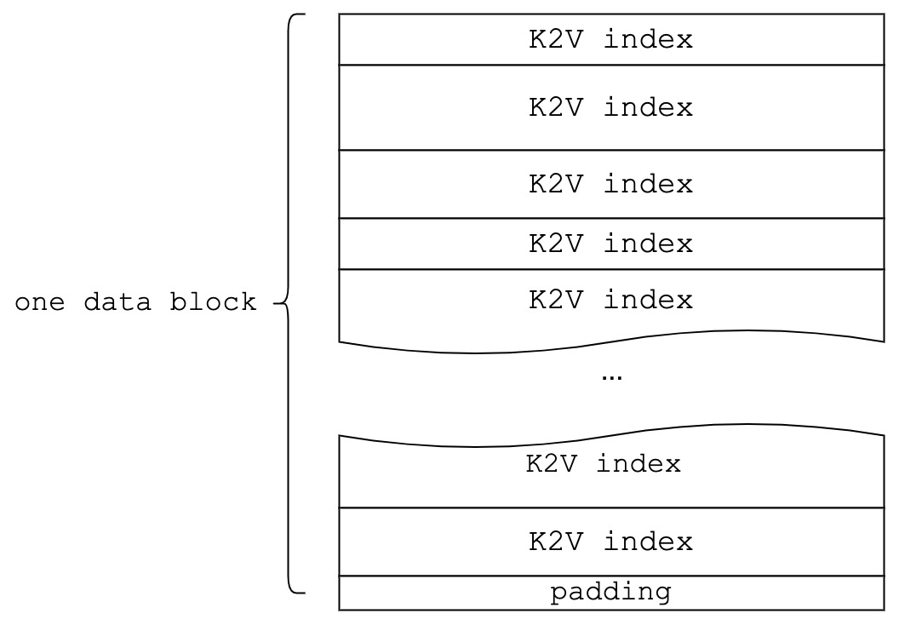
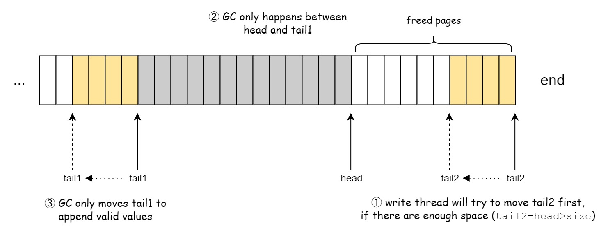

# YFS

A simple implementation of KEVIN.

Two parts: yfs in filesystem layer and yssd in block device layer.

yfs is responsible for translating POSIX syscalls to KV commands.

yssd is responsible for indexing KV objects and transaction management.

---

- [YFS](#yfs)
- [Overview](#overview)
- [YSSD](#yssd)
  - [Disk layout](#disk-layout)
  - [K2V index (LSM Tree)](#k2v-index-lsm-tree)
    - [Table layout](#table-layout)
      - [Meta block](#meta-block)
    - [Data Block](#data-block)
    - [K2V index](#k2v-index)
    - [MemIndex](#memindex)
    - [Flush](#flush)
    - [Compaction](#compaction)
  - [Value Log](#value-log)
    - [General Process](#general-process)
    - [Garbage Collection](#garbage-collection)
  - [Concurrency Control](#concurrency-control)

# Overview

# YSSD

## Disk layout

## K2V index (LSM Tree)

### Table layout

#### Meta block

### Data Block

### K2V index

### MemIndex

MemIndex is an in-memory rbtree, which stores the <start_key, end_key, ptr> of each data block.
These entries are sorted by the start_key and timestamp.
When we need to search for KV on disk, we first lookup MemIndex to get blocks that may store the key, and iterate by the time sequence.

### Flush

Keys in each SSTable are sorted.
The key range between SSTables can be overlapped. 
Each SSTable is 2MB, the reserved space for level0 is 8MB.

### Compaction

When there are 4 SSTables in level0, the compaction thread will merge all SSTables in level0, and appends to level1.

## Value Log

### General Process

### Garbage Collection

---

How space freed by GC is reused?

vlog maintains two queues: queue1(from `head` to `tail1`) and queue2(from `end` to `tail2`).

1. queue1 and queue2 store persisted KVs.
2. Flush will try to append new KVs to queue2 first.
3. GC always happens on queue1.
4. GC will also try to append valid KVs to queue2 first.

When `head` catches up with `tail1`, in other words, the length of queue1 becomes 0, then queue1 becomes queue2 and queue2 is reset(`tail2=end`):

## Concurrency Control

The concurrency control between multiple front-end access threads and back-end flush threads is quite complicated, because of the consistency between in-memory caching (MemTable in LSMTree and HashTable in value log) and persisted data. Even leveldb uses a global mutex to synchronize all user requests.

For simplicity, the basic policy:

1. GET/SET/DEL/ITER will try to hold the global mutex.
2. Value log manages one write deamon thread to perform flush/GC.
3. LSMTree manages another write deamon thread to perform compaction.

So, in YSSD layer, there exists only one access thread. The value log or LSMTree will only need to take care of the safety between access thread and its write thread.