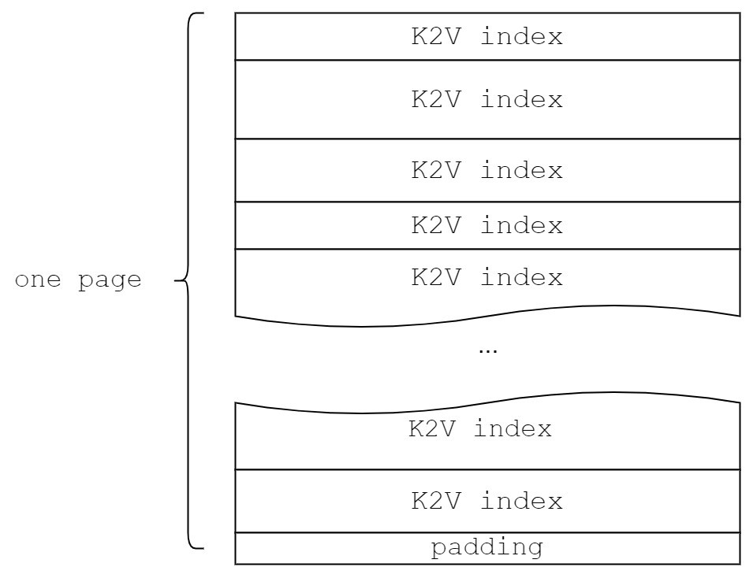

# yfs

A simple implementation of KEVIN.

Two parts: yfs in filesystem layer and yssd in block device layer.

yfs is responsible for translating POSIX syscalls to KV commands.

yssd is responsible for indexing KV objects and transaction management.

# overview

# YSSD

## Disk layout

## K2V index (LSM Tree)

### Table layout

#### Meta block

### Page layout

### K2V index

## Value Log

### General Process

### Garbage Collection

---

How to use space freed by GC?

vlog maintains two queue: queue1(from `head` to `tail1`) and queue2(from `end` to `tail2`).

1. queue1 and queue2 store persisted KVs.
2. Flush will try to appending new KVs to queue2 first.
3. GC always happens on queue1.
4. GC will append valid KVs to queue1.

When `head` catches up with `tail1`, in other words, the length of queue1 becomes 0, then queue1 becomes queue2 and queue2 is reset(`tail2=end`):

